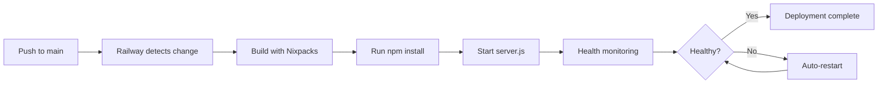

# Railway Auto-Deploy Setup

This document explains how to configure automatic deployment to Railway for the Site Monkeys AI System.

> **Note:** For comprehensive deployment instructions including server restart procedures, see [DEPLOYMENT.md](./DEPLOYMENT.md).

## Overview

The repository is configured to automatically deploy to Railway when changes are merged to the `main` branch. No manual deployment steps are required.

## Configuration Files

### railway.json

The `railway.json` file in the root directory configures Railway's deployment behavior:

```json
{
  "$schema": "https://railway.app/railway.schema.json",
  "build": {
    "builder": "NIXPACKS"
  },
  "deploy": {
    "startCommand": "node server.js",
    "restartPolicyType": "ON_FAILURE",
    "restartPolicyMaxRetries": 10
  }
}
```

## Required Environment Variables

The following environment variables must be configured in your Railway project settings:

### Critical Variables (Required)
- **DATABASE_URL**: PostgreSQL database connection string (automatically set when you add a PostgreSQL service)
- **OPENAI_API_KEY**: Your OpenAI API key for GPT-4 integration
- **ANTHROPIC_API_KEY**: Your Anthropic API key for Claude integration
- **SESSION_SECRET**: Secret key for session management (any random string, e.g., generated with `openssl rand -base64 32`)

### Optional Variables
- **NODE_ENV**: Set to `production` for production deployments
- **PORT**: Railway automatically provides this (application uses `process.env.PORT || 3000`)

## Setup Steps

### Initial Setup (One-Time)

1. **Create Railway Project**
   ```bash
   # Install Railway CLI (optional)
   npm i -g @railway/cli
   
   # Login to Railway
   railway login
   
   # Link your repository to Railway
   railway link
   ```

2. **Add PostgreSQL Database**
   - In Railway dashboard, click "New" → "Database" → "PostgreSQL"
   - Railway will automatically set DATABASE_URL

3. **Configure Environment Variables**
   - Go to your Railway project settings
   - Navigate to "Variables" tab
   - Add the required environment variables listed above

4. **Connect GitHub Repository**
   - In Railway dashboard, go to "Settings"
   - Under "Source", connect your GitHub repository
   - Select the `main` branch for automatic deployments

### Auto-Deploy Configuration

Once configured, Railway will automatically:

1. **Detect Changes**: Monitor the `main` branch for new commits
2. **Build**: Use Nixpacks to detect and build your Node.js application
3. **Deploy**: Start the application with `node server.js`
4. **Health Check**: Monitor the application and restart on failures (up to 10 retries)

## Deployment Workflow



## System Initialization Order

The system follows a strict initialization order to ensure stability:

1. **Express Server Setup**: Configure middleware, routes, error handlers
2. **10-Second Stability Window**: Allow server to fully stabilize
3. **Memory System Initialization**: Initialize PostgreSQL connection and memory systems
4. **Orchestrator Ready**: Process incoming chat requests

This order is critical and preserved in the codebase. The memory system initializes in the background after the server is stable to prevent startup delays that could trigger Railway's health check failures (Railway expects the application to bind to PORT within a reasonable timeframe).

## Health Checks

The application includes comprehensive health monitoring:

- **Database Connection**: Automatic pool health checks every 30 seconds
- **Memory System**: Fallback to in-memory storage if database fails
- **Error Recovery**: Unhandled rejections and exceptions are logged but don't crash the server

## Monitoring Deployment

You can monitor deployments in several ways:

### Railway Dashboard
- View build logs in real-time
- Monitor application logs
- Check deployment status and history

### Railway CLI
```bash
# View recent logs
railway logs

# Check deployment status
railway status

# Open project in browser
railway open
```

## Troubleshooting

### Deployment Fails
1. Check Railway build logs for errors
2. Verify all environment variables are set correctly
3. Ensure PostgreSQL service is running and connected

### Database Connection Issues
```bash
# Run database diagnostic script
npm run fix-database
```

### Memory Initialization Timeout
- Check DATABASE_URL is valid
- Verify PostgreSQL service is accessible
- Review server logs for initialization errors

## Manual Deployment (if needed)

While auto-deploy is configured, you can manually trigger deployments:

```bash
# Using Railway CLI
railway up

# Or redeploy from Railway dashboard
# Go to Deployments → Click "Deploy" button
```

## Security Notes

1. **Never commit secrets**: All sensitive credentials should be in Railway environment variables, not in code
2. **Session Secret**: Generate a strong random string for SESSION_SECRET (e.g., `openssl rand -base64 32`)
3. **Database SSL**: The system automatically uses SSL for production database connections (when NODE_ENV=production). See `memory_system/core.js` line 58 for configuration details.

## Support

For issues with Railway deployment:
- Check Railway status: https://railway.app/status
- Railway documentation: https://docs.railway.app
- Project logs in Railway dashboard

For application-specific issues:
- Review server logs in Railway dashboard
- Check memory system initialization logs
- Verify all environment variables are correctly set
